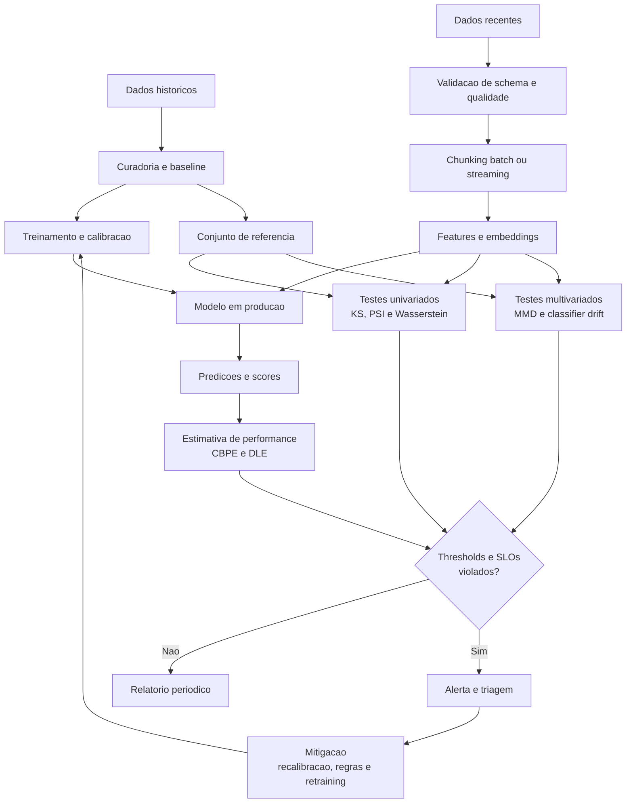

# Diagrama de Fluxo de Dados

O fluxo abaixo destaca a trajetoria dos dados desde a construcao do baseline ate a deteccao de drift, a estimativa de performance e a tomada de acao em producao.

## Ponto de atencao

Este fluxo representa um loop operacional. O objetivo nao e apenas detectar uma mudanca, mas conectar o sinal estatistico a uma resposta concreta e verificavel.