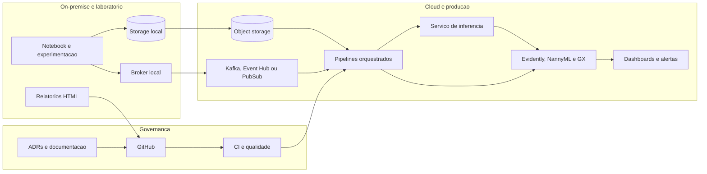

# Diagrama de Deployment

Este diagrama mostra uma topologia de referencia que combina laboratorio local, automacao em nuvem e camadas de governanca. A proposta e suportar tanto ensino quanto reproducao em cenarios proximos de producao.

## Interpretacao

- O laboratorio local acelera a iteracao didatica e a exploracao.
- A nuvem concentra orquestracao, servico de inferencia e monitoramento continuo.
- Git, ADRs e CI garantem rastreabilidade e repetibilidade ao longo do ciclo de vida.