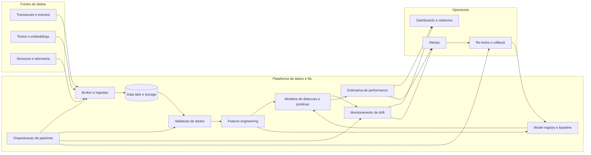

# Diagrama de Arquitetura de Sistema

Este diagrama resume a arquitetura end-to-end recomendada para os experimentos e exemplos da disciplina. Ele mostra como dados de varias naturezas entram no sistema, sao validados, alimentam modelos e geram sinais de observabilidade para resposta operacional.

## Leituras do diagrama

- A observabilidade do modelo nao e um componente lateral; ela faz parte do fluxo central do sistema.
- Baseline e versionamento sao tratados como artefatos de primeira classe.
- Orquestracao, alertas e re-treino fecham o loop de aprendizagem continua.