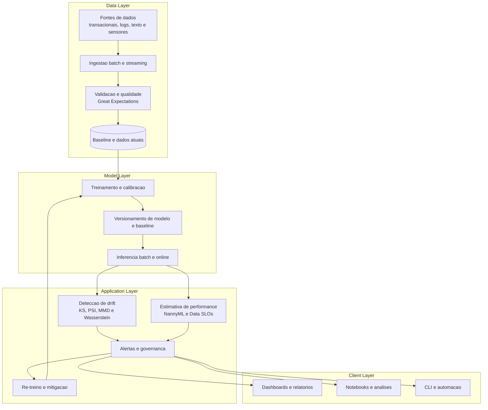

# Visao Geral da Arquitetura

## Visao Geral

As solucoes desta disciplina partem de um principio simples: um modelo de ML em producao precisa ser tratado como um sistema vivo, sujeito a mudancas no ambiente, nos dados e nos objetivos do negocio. Por isso, a arquitetura proposta nao cobre apenas treinamento e inferencia, mas tambem validacao de dados, observabilidade, governanca e resposta operacional a drift.

O fluxo tipico combina dados historicos e dados recentes para construir um baseline de referencia. Esse baseline alimenta o treinamento inicial do modelo e serve de comparador para metricas de drift ao longo do tempo. Em paralelo, os dados de producao passam por validacoes de schema e qualidade antes de seguirem para inferencia, monitoramento estatistico e estimativa de performance sem rotulo.

O objetivo pedagogico desta arquitetura e mostrar como testes classicos, metricas avancadas, aprendizado adaptativo e Data SLOs convivem em um pipeline unico. O repositorio foi desenhado para suportar tanto exercicios batch quanto cenarios de streaming e escala.

## Camadas da Aplicacao

### Data Layer

- Ingestao de dados batch e streaming.
- Armazenamento de dados historicos, baseline e amostras recentes.
- Validacao de schema, ranges, completude e qualidade.
- Preparacao de features tabulares, embeddings e janelas temporais.

### Model Layer

- Treinamento supervisionado e calibracao inicial.
- Versionamento de modelo, baseline e artefatos de referencia.
- Inferencia batch ou online em producao.
- Suporte a re-treino, aprendizado online e ensembles adaptativos.

### Application Layer

- Calculo de metricas de drift univariadas e multivariadas.
- Estimativa de performance sem rotulo e acompanhamento de SLOs.
- Gatilhos de alerta, triagem, rollback e pipelines de mitigacao.
- Integracao com dashboards, automacoes e processos de governanca.

### Client Layer

- Notebooks para experimentacao e diagnostico.
- Dashboards para observabilidade operacional.
- Scripts e automacoes para reproducao de pipelines.
- Documentacao para auditoria tecnica e alinhamento entre times.

## Padroes Arquiteturais

- Pipeline: organiza ingestao, validacao, feature engineering, inferencia e monitoramento como estagios composiveis.
- Strategy: permite trocar metricas de drift, criterios de threshold e acoes de mitigacao conforme o contexto.
- Observer: trata alertas, dashboards e gatilhos de SLO como eventos do sistema.
- Repository: separa acesso a dados historicos, baseline e resultados de monitoramento.
- Factory: facilita a instancia de detectores, modelos e validadores conforme o tipo de dado.
- Adapter: integra bibliotecas com interfaces distintas, como Evidently, NannyML e Great Expectations.

## Diagrama de Arquitetura

## Decisoes Tecnicas

As principais decisoes de arquitetura deste repositorio estao documentadas nos ADRs abaixo:

- [ADR-0001 - Stack principal em Python e open source](./adr/0001-stack-principal-python-open-source.md)
- [ADR-0002 - Estrategia hibrida para deteccao de drift](./adr/0002-estrategia-hibrida-deteccao-drift.md)
- [ADR-0003 - Monitoramento continuo orientado a Data SLOs](./adr/0003-monitoramento-continuo-data-slos.md)
- [ADR-0004 - Mitigacao em camadas com re-treino e aprendizado online](./adr/0004-mitigacao-em-camadas.md)
- [ADR-0005 - Arquitetura dual batch e streaming](./adr/0005-arquitetura-dual-batch-streaming.md)