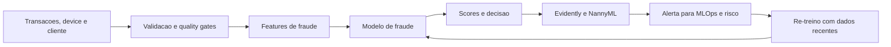

# Business Case: Fraud Detection in Digital Payments

## Contexto de Negocio

Uma fintech de pagamentos digitais cresce rapidamente apos expandir sua aquisicao de clientes para novos canais e novas geografias. O modelo de fraude, treinado com dados historicos estaveis, passa a operar sobre um mix de transacoes diferente: mais usuarios recem-cadastrados, maior variacao de ticket medio e novos padroes de device fingerprint.

## Problema

Nos tres meses seguintes ao crescimento, a equipe de risco observa aumento de chargeback, maior volume de revisao manual e mais reclamacoes de clientes bloqueados indevidamente. Os KPIs atuais mostram:

- aumento de chargeback sobre o volume transacionado;
- piora na precisao do modelo;
- aumento do tempo para identificar que a base mudou.

## Solucao com ML

A solucao combina um modelo supervisionado de risco transacional com monitoramento continuo de drift e estimativa de performance sem rotulo. Variaveis como valor da transacao, idade da conta, geolocalizacao, dispositivo e historico de comportamento sao monitoradas com Evidently, enquanto o impacto no modelo e acompanhado com NannyML. Antes da inferencia, Great Expectations valida schema e regras criticas de dados.

### Arquitetura da Solucao

## ROI Esperado

- Reducao de 22% nas perdas por chargeback em 12 meses.
- Reducao de 30% no volume de revisao manual de transacoes de baixo risco.
- Reducao do tempo medio de deteccao de drift de 14 dias para menos de 24 horas.
- Aumento da estabilidade operacional com menor numero de incidentes de risco nao detectados.

## Metricas de Sucesso

| Indicador | Baseline | Meta | Observacao |
| --- | --- | --- | --- |
| Fraud capture rate | 72% | 84% | Melhor recall sem explodir revisao manual |
| Precision do modelo | 0.38 | 0.50 | Menor atrito para clientes legitimos |
| Chargeback / volume transacionado | 1.8% | 1.2% | Impacto financeiro direto |
| Tempo para detectar drift | 14 dias | < 24h | Meta de observabilidade operacional |
| Percentual de lotes invalidados | 0% medido | < 2% | Controle de qualidade de dados |

## Riscos e Mitigacoes

- Rotulos demorados: usar estimativa de performance com NannyML e revisao humana amostral.
- Drift adversarial: combinar monitoramento estatistico com regras de negocio emergenciais.
- Falsos positivos de alerta: revisar thresholds por segmento e janelas temporais.
- Problemas de qualidade de dados: bloquear inferencia quando expectativas criticas falharem.

## Tecnologias

- Python, Pandas, SciPy e scikit-learn.
- Evidently para deteccao de drift.
- NannyML para estimativa de degradacao sem rotulo.
- Great Expectations para quality gates.
- JupyterLab para exploracao e diagnostico.

## Implementacao

- [Aula 2 - Deteccao estatistica](../../02_deteccao_estatistica_de_drift_de_dados/)
- [Aula 3 - Mitigacao](../../03_estrategias_de_mitigacao_de_drift/)
- [Aula 6 - Monitoramento e Data SLOs](../../06_monitoramento_continuo_e_data_slos_em_producao/)
- [Aula 8 - Integracao e validacao](../../08_integracao_e_revisao_ferramentas_e_validacao/)

## Referencias

- Rabanser et al. Failing loudly: dataset shift detection.
- Muller et al. Open-source drift detection tools in action.
- Sculley et al. Hidden technical debt in machine learning systems.