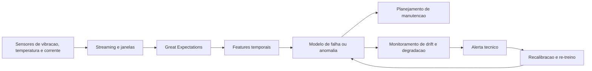

# Business Case: Predictive Maintenance in Industry

## Contexto de Negocio

Uma operacao industrial monitora linhas de producao com sensores de vibracao, temperatura, corrente e pressao. O objetivo e antecipar falhas de ativos criticos e reduzir paradas nao planejadas. Entretanto, trocas de sensor, mudancas de fornecedor, manutencoes e alteracoes de regime operacional fazem o perfil dos dados mudar continuamente.

## Problema

O modelo de falha foi treinado com dados historicos de uma configuracao de operacao que ja nao representa o estado atual das maquinas. Como resultado, a equipe enfrenta aumento de falsos alarmes em alguns turnos e perda de recall em outros, o que compromete tanto a confianca no sistema quanto o retorno do investimento em manutencao preditiva.

## Solucao com ML

A solucao usa ingestao em streaming, validacao de dados de sensores e monitoramento em janelas temporais para medir drift estatistico e degradacao do modelo. Em cenarios de mudanca persistente, o pipeline permite recalibrar thresholds, atualizar features temporais e realizar re-treino incremental ou em lote com dados mais recentes.

### Arquitetura da Solucao

## ROI Esperado

- Reducao de 18% nas horas de parada nao planejada.
- Reducao de 12% no custo de manutencao corretiva anual.
- Reducao de 25% nos falsos alarmes que geram deslocamento desnecessario da equipe.
- Melhor priorizacao de ativos criticos com base em risco atualizado.

## Metricas de Sucesso

| Indicador | Baseline | Meta | Observacao |
| --- | --- | --- | --- |
| Recall de falhas criticas | 0.68 | 0.80 | Meta principal de seguranca operacional |
| Taxa de falsos alarmes | 19% | 12% | Menor fadiga operacional |
| Tempo para detectar drift | 21 dias | < 12h | Reacao compativel com operacao industrial |
| Horas de parada nao planejada por mes | 110h | 90h | Impacto direto em produtividade |
| Lotes rejeitados por qualidade de sensor | nao medido | < 3% | Controle de dados ruins na origem |

## Riscos e Mitigacoes

- Confundir falha de sensor com drift real: aplicar validacao de schema e checks fisicos antes da inferencia.
- Escassez de rotulos de falha: usar sinais de degradacao, logs de manutencao e confirmacao posterior.
- Conectividade instavel em edge: projetar buffers e janelas tolerantes a atraso.
- Custo computacional em tempo real: separar camadas de alerta rapido e analise profunda.

## Tecnologias

- Python, Pandas, SciPy e scikit-learn.
- River para aprendizado incremental.
- Great Expectations para qualidade de dados.
- Evidently e metricas estatisticas para drift.
- Broker de eventos e processamento em janelas para cenarios de escala.

## Implementacao

- [Aula 2 - Deteccao estatistica](../../02_deteccao_estatistica_de_drift_de_dados/)
- [Aula 3 - Mitigacao](../../03_estrategias_de_mitigacao_de_drift/)
- [Aula 4 - Metricas avancadas](../../04_metricas_avancadas_para_deteccao_de_drift/)
- [Aula 7 - Escala e streaming](../../07_otimizacoes_e_escala_no_monitoramento_de_drift/)
- [Aula 8 - Integracao e validacao](../../08_integracao_e_revisao_ferramentas_e_validacao/)

## Referencias

- Gama et al. Survey on concept drift adaptation.
- Polyzotis et al. Data validation for machine learning.
- Hinder et al. Survey on monitoring evolving environments.