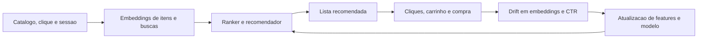

# Business Case: Recommendation System for E-commerce

## Contexto de Negocio

Um marketplace de varejo digital opera um sistema de recomendacao para ordenar vitrines, sugerir itens relacionados e apoiar campanhas promocionais. A cada semana entram novos produtos, termos de busca ganham novos significados e eventos sazonais alteram rapidamente o comportamento de compra.

## Problema

Mesmo com um modelo inicialmente competitivo, a equipe de growth observa queda em CTR e conversao apos mudancas no catalogo e no perfil de navegacao. O problema nao aparece de forma clara em variaveis tabulares simples, porque boa parte do sinal esta em embeddings de titulo, descricao e historico de sessao.

## Solucao com ML

A solucao usa embeddings de produtos e interacoes para alimentar um ranker de recomendacao. O monitoramento e feito em duas frentes: drift em embeddings e distribuicoes de entrada, alem de degradacao em metricas de negocio como CTR, add-to-cart e conversao. Quando o sistema detecta deterioracao persistente, o pipeline aciona atualizacao de features, reprocessamento de embeddings e re-treino do ranker.

### Arquitetura da Solucao

## ROI Esperado

- Aumento de 9% no CTR das areas recomendadas.
- Aumento de 5% na taxa de conversao atribuida ao recomendador.
- Reducao de 20% no esforco manual de curadoria de vitrines.
- Maior velocidade para reagir a catalogo novo, sazonalidade e eventos de mercado.

## Metricas de Sucesso

| Indicador | Baseline | Meta | Observacao |
| --- | --- | --- | --- |
| CTR das recomendacoes | 5.2% | 5.7% | Sensivel a drift semantico e de comportamento |
| Conversao atribuida | 2.8% | 3.1% | Impacto no resultado comercial |
| Cobertura de catalogo relevante | 61% | 75% | Menor obsolescencia de itens recomendados |
| Tempo para detectar drift em embeddings | 10 dias | < 48h | Observabilidade aplicada a NLP |
| Tempo para atualizar o ranker | 7 dias | 2 dias | Ciclo de resposta mais curto |

## Riscos e Mitigacoes

- Cold start de itens novos: combinar embeddings com regras de exploracao controlada.
- Feedback atrasado ou enviesado: acompanhar metricas de negocio e sinal estatistico em conjunto.
- Drift sazonal falso positivo: revisar thresholds por calendario promocional.
- Vies de recomendacao: monitorar impacto por categorias e grupos de usuarios.

## Tecnologias

- Transformers e PyTorch para embeddings.
- scikit-learn para testes auxiliares e classifier drift.
- UMAP-learn para visualizacao de espacos latentes.
- Evidently e NannyML para observabilidade.
- spaCy ou NLTK para preprocessamento textual.

## Implementacao

- [Aula 1 - Fundamentos](../../01_fundamentos_do_data_drift_em_ml/)
- [Aula 5 - Embeddings e testes de duas amostras](../../05_drift_em_embeddings_e_testes_de_duas_amostras/)
- [Aula 6 - Monitoramento e Data SLOs](../../06_monitoramento_continuo_e_data_slos_em_producao/)
- [Aula 8 - Integracao e validacao](../../08_integracao_e_revisao_ferramentas_e_validacao/)

## Referencias

- Devlin et al. BERT: Pre-training of deep bidirectional transformers.
- Lopez Paz and Oquab. Classifier two-sample tests.
- Hinder et al. Survey on monitoring evolving environments.