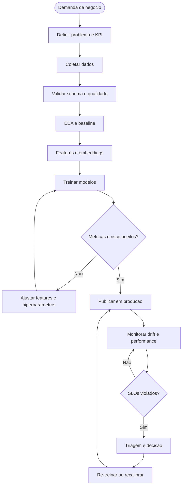

# Processo End-to-End de ML em Producao

O diagrama abaixo resume o processo de negocio e engenharia recomendado para construir, operar e manter modelos de ML sujeitos a drift.

## Observacoes

- O processo explicita que treinamento sem monitoramento deixa o ciclo incompleto.
- Validacao de dados e observabilidade devem entrar antes e depois da inferencia.
- A resposta a drift precisa estar acoplada a KPIs, SLOs e responsabilidade operacional.