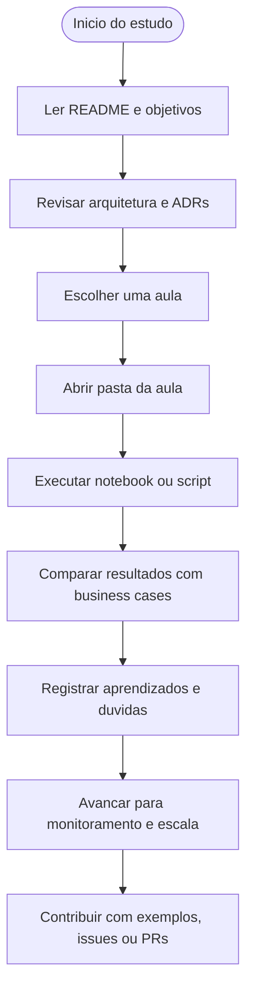

# Jornada do Estudante e do Cientista de Dados

Este diagrama representa a experiencia esperada de quem usa o repositorio para estudar, gerar codigo e evoluir os exemplos ao longo do curso.

## Observacoes

- A jornada foi desenhada para partir de fundamentos e evoluir ate operacao em escala.
- ADRs e business cases funcionam como ponte entre teoria, arquitetura e implementacao.
- O repositorio foi preparado para receber conteudo pratico por aula sem perder a coerencia global.